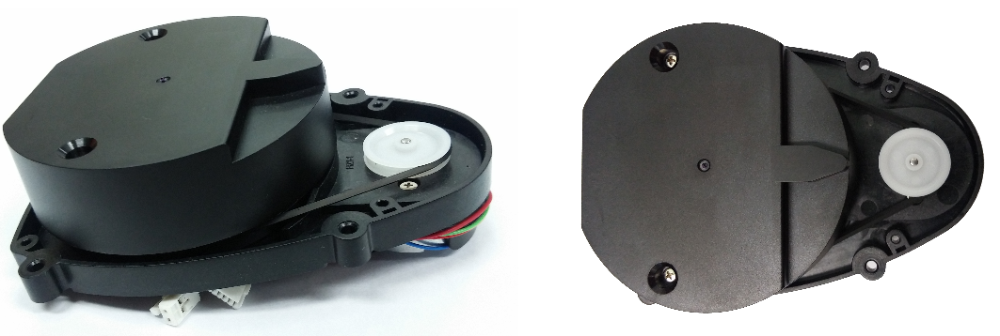

# LDS LIDAR

## Install

```
mkdir build
cd build
cmake ..
make
make package
dpkg -i lds-x.x.x-Linux.deb
```

## Example

```c++
#include <lds/lds.hpp>
#include <string>

using namespace std;
using namespace lds;

int main(int argc, char **argv) {
    try {
        string port = "/dev/ttyUSB0";
        LDS01 laser;
        laser.open(port);   // defaults to correct baud rate
        laser.motor(true);  // start lidar spinning

        int count = 5;  // grab 5 readings and stop

        while (count--) {
            laser.read();

            printf("[LDS Ranges] -----------------------\n");
            for (const auto r: laser.scan) printf("%.2f ", r / 1000.0);
            printf("\n");
        }

        return 0;
    }
    catch (boost::system::system_error ex) {
        printf("An exception was thrown: %s", ex.what());
        return -1;
    }
}
```

# References

- [Original ROS driver github](https://github.com/ROBOTIS-GIT/hls_lfcd_lds_driver)

# MIT License

**Copyright (c) 2019 Kevin J. Walchko**

Permission is hereby granted, free of charge, to any person obtaining a copy
of this software and associated documentation files (the "Software"), to deal
in the Software without restriction, including without limitation the rights
to use, copy, modify, merge, publish, distribute, sublicense, and/or sell
copies of the Software, and to permit persons to whom the Software is
furnished to do so, subject to the following conditions:

The above copyright notice and this permission notice shall be included in all
copies or substantial portions of the Software.

THE SOFTWARE IS PROVIDED "AS IS", WITHOUT WARRANTY OF ANY KIND, EXPRESS OR
IMPLIED, INCLUDING BUT NOT LIMITED TO THE WARRANTIES OF MERCHANTABILITY,
FITNESS FOR A PARTICULAR PURPOSE AND NONINFRINGEMENT. IN NO EVENT SHALL THE
AUTHORS OR COPYRIGHT HOLDERS BE LIABLE FOR ANY CLAIM, DAMAGES OR OTHER
LIABILITY, WHETHER IN AN ACTION OF CONTRACT, TORT OR OTHERWISE, ARISING FROM,
OUT OF OR IN CONNECTION WITH THE SOFTWARE OR THE USE OR OTHER DEALINGS IN THE
SOFTWARE.
